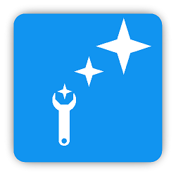

# CLAF

# Framework for building Garry's Mod addons

CLAF stands for **CL** ean **A** ddon **F** ramework.  
CLAF is a set of wrappers for standard API which makes the Garry's Mod addons development easy.  
See [wiki](https://github.com/javabird25/gmod-claf/wiki) for the documentation.

# Why to use?
CLAF provides functional programming, aliases and shortcuts for standard API to make addon programming easier.

# Features
## Functional programming
Quickly modify tables with functional programming features:

```lua
-- Filtering numbers in traditional way...
local numbers = {1, 2, 3, 4, 5}
for k, number in pairs(numbers) do
    if number % 2 != 0 then
        numbers[k] = nil
    end
end

-- ...and in functional way

local numbers = {1, 2, 3, 4, 5}
numbers = Filter(function(x) return IsOdd(x) end, numbers)
```

## Popular language features simulation
### Try-catch
Run code that can cause errors in `Try()`:

```lua
Try(function()
    -- some error-potential code
end,
-- error handler
function(errorMessage)
    print('something went wrong: '..errorMessage)
end)
```

### Enums and flags
```lua
LiquidType = Enum('WATER', 'LAVA', 'OIL')
bottle = {liquid = LiquidType.WATER}
```

```lua
Settings = Flags('SHOW_WELCOME', 'SHOW_HELP', 'SHOW_HINTS')

-- Combining flags
userSettings = bit.bor(Settings.SHOW_WELCOME, Settings.SHOW_HELP)

-- Reading flags
welcome = bit.band(userSettings, Settings.SHOW_WELCOME) -- true
help = bit.band(userSettings, Settings.SHOW_HELP)    -- true
hints = bit.band(userSettings, Settings.SHOW_HINTS) -- false
```

<!-- ## How to use?
### Development phase
Subscribe to CLAF addon in Steam Workshop.
In source files where you use CLAF, add the following line to the beginning:
```lua
include 'claf.lua'
```

### Deploy phase
Add dependency of CLAF Steam Workshop addon on your addon. -->
